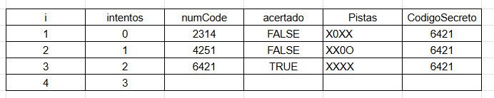
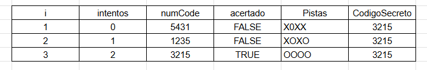
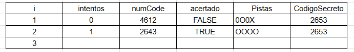
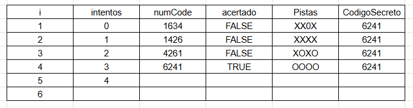
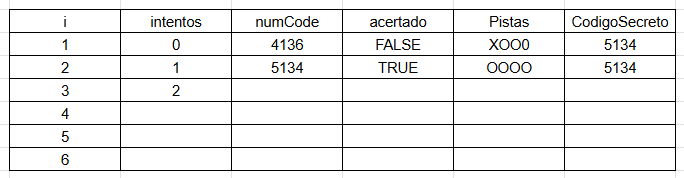

     # Mastermind

Lo primero que hice fue inciar plantearme que haria en este caso que usaria y que cosas tiene que tener para que sea mas intuitivo para el usuario .
Comence por las constantes que presentarian al usuario que es el juego y como funciona , despues hice swicth que serviria de menu para que el usuario pueda escoger la dificultat que tendra en este caso en numero de intentos .
Una vez acabado eso decidi por usar una funcion que se encargaria del juego , esta serviria para que el usuario pueda ingresar numeros y guardarlos en una arrays , para contar los intentos , y para hacer la verificacion del numero es correcto en el caso de que no sea correcto llamariamos a otra funcion que brindaria las pistas, estas se encargara de dar pistas a cada numero ingresado por el usuario .

using System;

public class Mastermind
{
public static void Main()
{
const string Bienvenida = "Bienvenido a Mastermind";
const string Elije = "Escriba un número para seleccionar su dificultad";
const string MenuMsg = "Elija una dificultad. \n0. Dificultad novato: 10 intentos. \n1. Dificultad aficionado: 6 intentos. \n2. Dificultad experto: 4 intentos. \n3. Dificultad Master: 3 intentos. \n4. Dificultad Personalizada. ";
const string Explicacion = "Este juego consiste en adivinar el Código Secreto, para esto uste deberá escoger una dificultad y según esa dificultad tendrá una cantidad limitada de intentos, también tendrá la ayuda de pista que le podrán ayudar a descubrir el Código Secreto.";

        Console.WriteLine(Bienvenida);
        Console.WriteLine(Explicacion);
        Console.WriteLine(" ");
        Console.WriteLine(MenuMsg);
        Console.WriteLine(Elije);

        int dificultad = Convert.ToInt16(Console.ReadLine());
        int intentosMax;

        switch (dificultad)
        {
            case 0:
                Console.WriteLine("Dificultad novato: 10 intentos");   
                intentosMax = 10;
                
                break;
            case 1:
                Console.WriteLine("Dificultad aficionado: 6 intentos");
                intentosMax = 6;
                break;
            case 2:
                Console.WriteLine("Dificultad experto: 4 intentos");
                intentosMax = 4;
                break;
            case 3:
                Console.WriteLine("Dificultad Master: 3 intentos");
                intentosMax = 3;
                break;
            case 4:
                Console.WriteLine("Dificultad Personalizada: Ingrese el número de intentos deseados:");        
                intentosMax = Convert.ToInt16(Console.ReadLine());
                break;
            default:
                Console.WriteLine("Dificultad escogida errónea. Eres un novato.");
                intentosMax = 10;
                break;
        }

        JUEGO(intentosMax);
    }

    public static void JUEGO(int intentosMax)
    {
        const string Carga = "Generando número............ \nNúmero generado, puede iniciar.";
        const string Separacion = "************************************************************************************************************************";
        const string Pistas = "Pistas:\n0 ==== Indica un número incorrecto. \nO ==== Indica un número correcto y en la posición correcta. \nX ==== Indica un número correcto pero en la posición incorrecta.";
        const string Explicacion = "Debe colocar 4 numeros que usted crea que sea el Codigo Secreto, el numero debe es del 1 al 6 y al introducrirlo debe ser de uno en uno. ";

        Console.WriteLine(Separacion);
        Console.WriteLine(Carga);
        Console.WriteLine("");
        Console.WriteLine(Pistas);
        Console.WriteLine("");
        Console.WriteLine(Explicacion);

        const int num1 = 5;
        const int num2 = 1;
        const int num3 = 3;
        const int num4 = 4;

        int[] combinacionSecreta = { num1, num2, num3, num4 };
        int intentos = 0;
        bool acertado = false;

        while (intentos < intentosMax && !acertado)
        {
            Console.WriteLine(Separacion);
            Console.WriteLine($"Intento {intentos + 1} de {intentosMax}. Introduzca 4 números:");
            int[] numCode = new int[4];

            for (int i = 0; i < numCode.Length; i++)
            {
                numCode[i] = int.Parse(Console.ReadLine());
            }

           
            if (numCode[0] == num1 && numCode[1] == num2 && numCode[2] == num3 && numCode[3] == num4)
            {
                acertado = true;
                Console.WriteLine("¡Lo has conseguido!");
                Console.WriteLine(Separacion);
            }
            else
            {
                
                Pista(numCode, combinacionSecreta);
            }

            intentos++;
        }

        
        if (!acertado)
        {
            Console.WriteLine("Se han agotado los intentos. El juego ha terminado.");
            Console.WriteLine($"El codigo secreto es:{num1}{num2}{num3}{num4}.");
            Console.WriteLine("Gracias por jugar");
            Console.WriteLine(Separacion);
        }
    }

    public static void Pista(int[] numCode, int[] combinacionSecreta)
    {
       
        const char Pista1 = '0';  // Indica un número incorrecto
        const char Pista2 = 'O';  // Indica un número correcto y en la posición correcta
        const char Pista3 = 'X';  // Indica un número correcto pero en la posición incorrecta

        Console.WriteLine("Pistas:");
        
        for (int i = 0; i < numCode.Length; i++)
        {
            if (numCode[i] == combinacionSecreta[i])
            {
                
                Console.WriteLine(Pista2);
            }
            else
            {
                
                bool numeroExiste = false;
                for (int j = 0; j < combinacionSecreta.Length; j++)
                {
                    if (numCode[i] == combinacionSecreta[j] && i != j)
                    {
                        numeroExiste = true;
                    }
                }

                if (numeroExiste)
                {
                    
                    Console.WriteLine(Pista3);
                }
                else
                {
                    
                    Console.WriteLine(Pista1);
                }
            }
        }
    }
}
1. Creo que cada funcion y variable tiene una accion definida y nos muestra su proposito en el nombre tanto de la funcion como en variables y constates .
2. Aunque no se controles los posibles errores que se introduzcan por teclado se deja con claridad lo que se debe colocar en este caso numero del 1 al 6 .
3. Juego de Pruebas : 	

